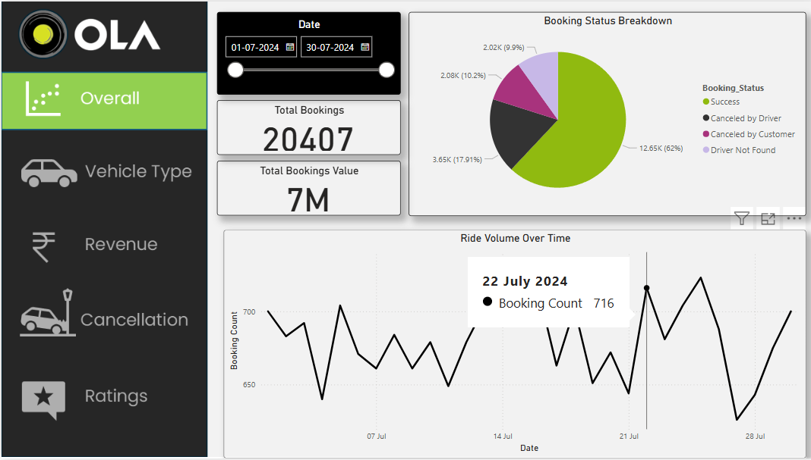
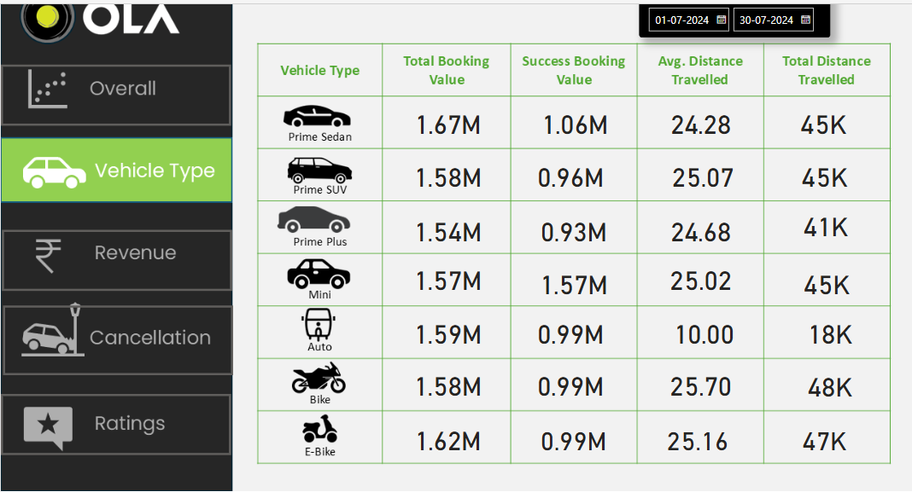
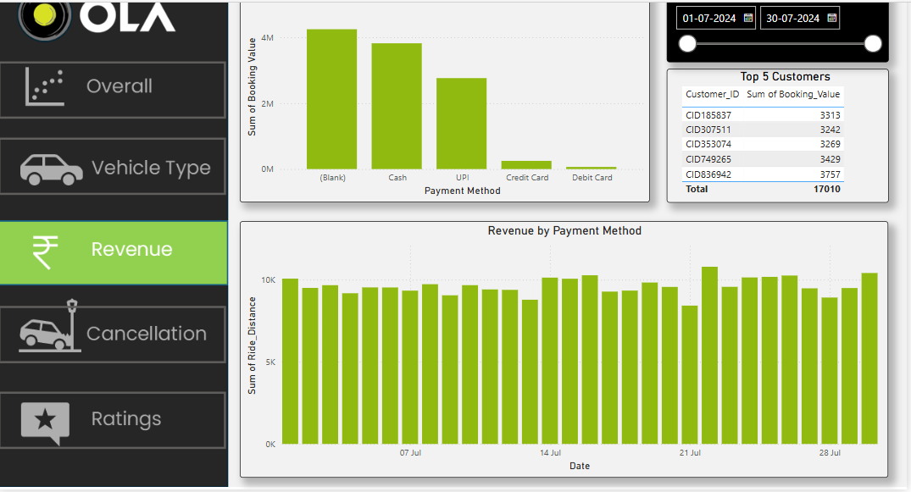
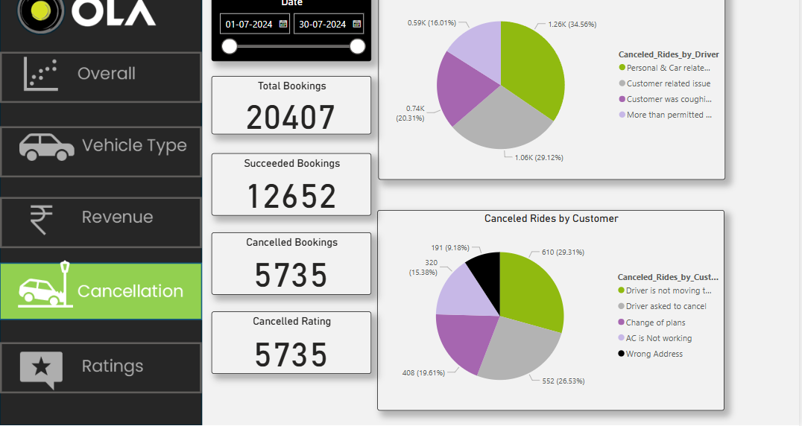
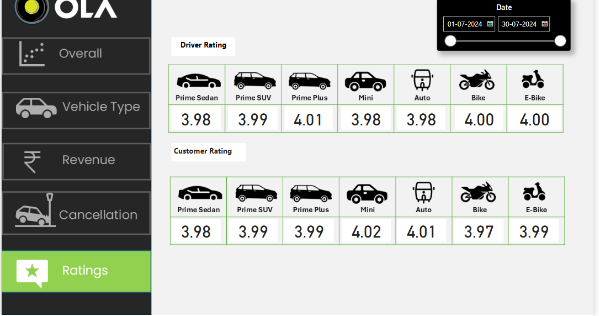

# 🚖 Ola Data Analytics

## 📊 Project Overview
This project analyzes Ola ride-hailing data to uncover key insights into revenue, cancellations, ratings, and overall vehicle performance. The dashboards provide a comprehensive view of trends, helping businesses and analysts make data-driven decisions.

## 📂 Dataset
The dataset includes the following features:
- **Ride Details:** Date, Time, City, Vehicle Type, Distance
- **Revenue Metrics:** Fare, Discounts, Payment Type
- **User Ratings:** Customer feedback, Star Ratings
- **Cancellations:** Cancellation reasons, Driver/User cancellations

## 🖼️ Dashboards
Below are the five interactive dashboards developed for the project:

### 1️⃣ **Overall Summary Dashboard**
   
   - Provides a high-level overview of ride statistics.
   - Displays total revenue, total rides, and average fare per ride.

### 2️⃣ **Vehicle Type Analysis**
   
   - Analyzes revenue, ride count, and performance by vehicle type.
   - Compares popular ride choices across different cities.

### 3️⃣ **Revenue Analysis**
   
   - Tracks revenue trends over time.
   - Identifies peak revenue hours and high-performing cities.

### 4️⃣ **Cancellation Insights**
   
   - Examines ride cancellations by users and drivers.
   - Highlights key reasons for cancellations and trends.

### 5️⃣ **User Ratings & Satisfaction**
   
   - Analyzes customer feedback and ratings.
   - Displays average ratings and sentiment trends.

## 🛠️ Technologies Used
- **Python 🐍** (Pandas, Matplotlib, Seaborn)
- **Power BI 📊** for interactive dashboards
- **SQL 🗄️** for data extraction and transformation

## 📌 Conclusion
This project provides valuable insights into Ola’s operations. The dashboards help understand user behavior, optimize revenue, and improve overall service quality.

## 📩 Contact
For any queries or collaboration, feel free to reach out!

🔗 **LinkedIn:** [Your LinkedIn](https://www.linkedin.com/in/j-priyanka-735056305/)  

